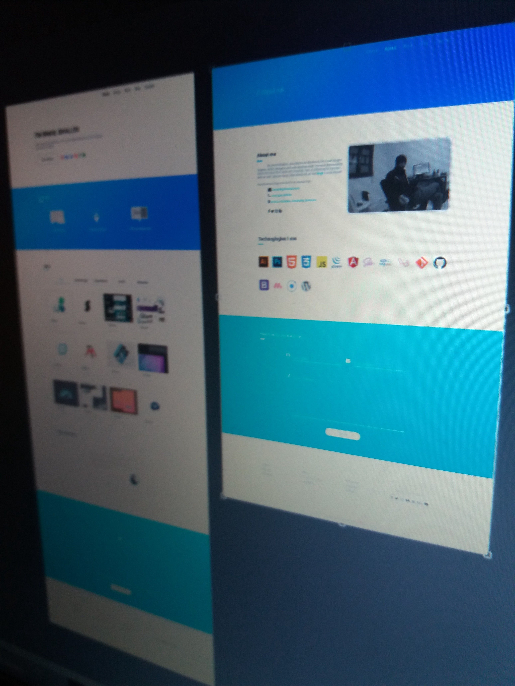
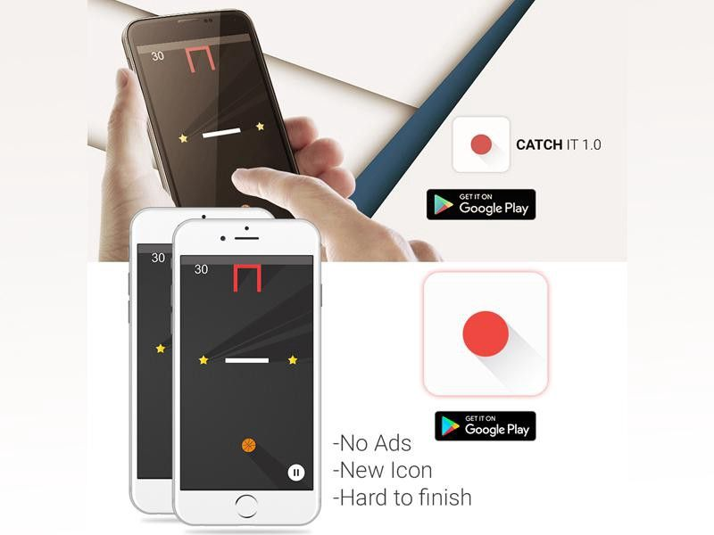

## I started Learning Design 1st

- I learned Adobe Illustrator & Photoshop --Then Adobe XD later on-- easily since I was playing with Adobe After Effects when I was a little boy.
- I started practicing by Designing stuff for myself like, logos / User interfaces / business cards / social media banners / illustrations & editing pictures…
- Some of my friends have suggested sharing my work on Behance which I did so & once I made a twitter account, I started getting clients from all over the world.

## Dev

Then I started learning web development, of course I started with front-end development:

- I learned the basics of HTML, CSS and JavaScript in order to make an unresponsive one page website, then a responsive website with my own grid system which was based on floats & widths.
- Then I learned few JavaScript Libraries mainly Jquery and then in 2017 I learned Angular 4 but switched to the React eco-system in the begining of 2017.
- I learned some UI frameworks as well like Bootstrap, Materialize, Bulma, Lostgrid, Material UI, Tachyons and I made my own little css framework called [Unnamed](https://unnamed.smakosh.com).
- I learned Sass, Pug (named Jade in the past) & ES6 as well.
- I launched several versions of my personal website using different tech stacks & different looks.

I started getting some clients work but unfortunately seeking for Wordpress templates from scratch which was really hard at that time as I was still learning PHP & MySQL anyway I took the challenge and designed the UI, coded it & then converted it to a wordpress template, I used plugins all over to let the client edit stuff easily but that made the website really slow, http://singaporeview.com he then paid me more to remove my copyrights but still you can find my name on the style file :D http://singaporeview.com/wp-content/themes/kgs/style.css

I also made other Wordpress websites using premium templates but I really hated it. I'm not a fan of CMS but I recently became a fan of headless CMS.

I wanted to get into mobile dev too but I had no idea how to make a mobile app, so after a little research I found out that there is a software called Build Box that lets you make mobile games without any programming skills, you only need to design all the stuff & the drag n drop will do the work and your app is done, which was the tool I used to make [Catch it 1.0](https://play.google.com/store/apps/details?id=com.smakosh.atchit) https://www.behance.net/gallery/38505463/Catch-it-10-My-first-android-mobile-game.

I wanted to get into the native dev world but I was too lazy to learn Java or Swift so I played with the Ionic framework which isn't native but hybrid but I wanted to get my hands dirty and I made a little portfolio app which I'm planning to delete soon.

1 Year has passed and I decided that to get into back-end dev as well, It was so hard to choose between php or nodejs (which is simply server side javascript) & at the end I went with php and MySQL due to the decision of my dad --who didn't let me drop out from university at that time-- because it was in the program (php/mysql).

So I started learning it by practicing once I understood the core language (variables, loops, statements...) then I started making some web apps like a forum, [E-commerce](https://github.com/smakosh/Smartshop), an [image resizer](https://github.com/smakosh/image-resizer) etc....

While learning back-end dev, I made some works too like this [responsive website](https://luca-steeb.com) for my friend Luca Steeb & it was my first time using Git, Github & Ubuntu since the website's back end uses Nodejs & I learned some stuff about npm & CLI commands :D

But late 2017, I started learning the MEAN stack and made some apps which are open sourced on my [Github account](https://github.com/smakosh).

Currently --early 2018-- I'm still learning so much stuff like Express, Mongoose, Gatsby, Neural networks, Python, Flask, Tensorflow, Keras....

I really want to thank the people on the internet who taught me these things and the folks who open source so many great products. Also thanks to the friends who helped me through my early learning career.

> "The purpose of education is to help you learn by yourself"
