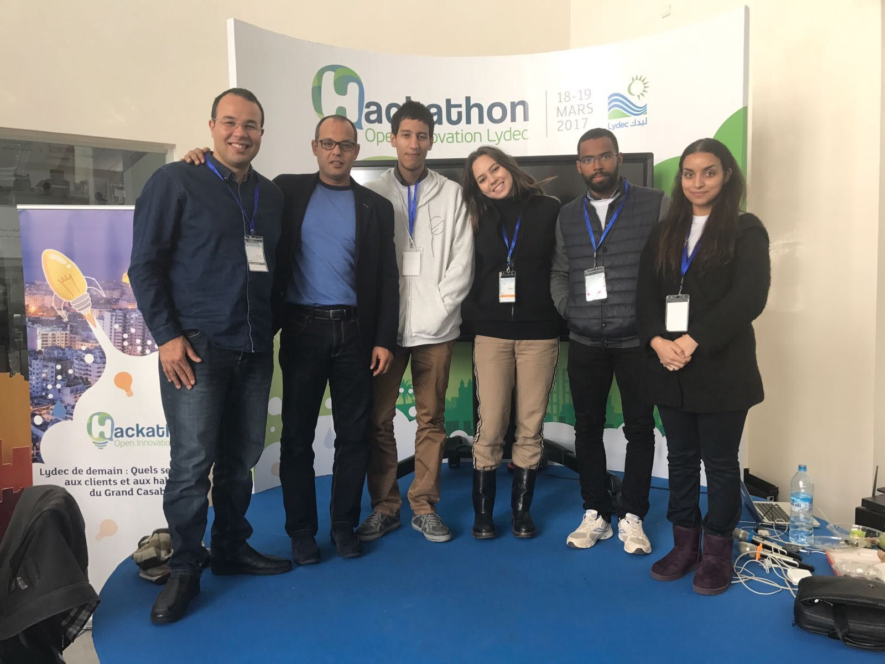
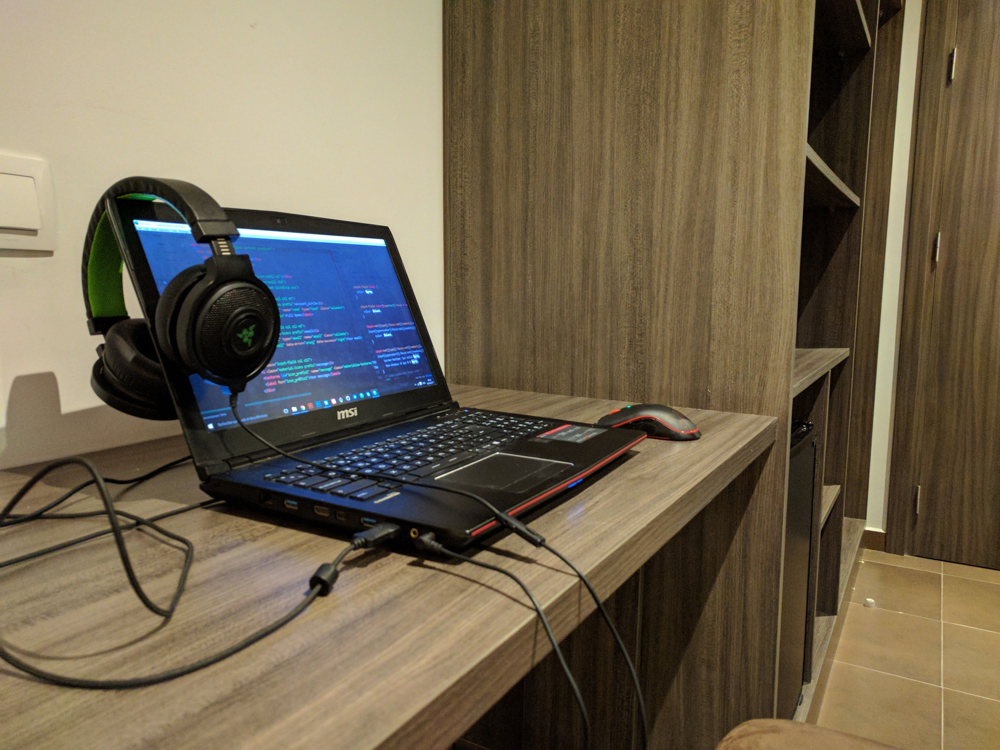
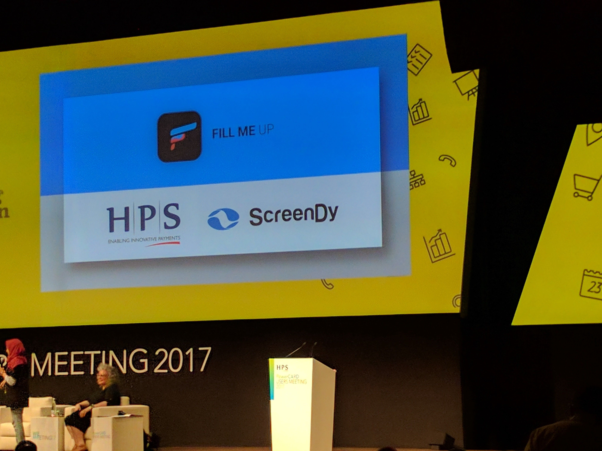

After winning the second prize at the Lydec Hackathon organized by Screendy.

I got invited to join the student partner program of Screendy — thanks to Mehdi Alaoui (the Founder & CEO of Screendy) — to help the participants during the international HPS hackathon hosted in Marrakesh. Two of my friends who live in my hometown got an invite to participate too, so we took the road to Marrakesh, we arrived after 12 hours of travel lol, we took some pictures of some great places there.

We waited for others at the train station, we then got transferred to the Palmeraie resorts Hotel. I met again the SSP team who were really amazing & nice to me, we prepared everything (badges, shirts….) to welcome 80 participants from 20 countries, 20 HPS clients & partners, 30 HPS employees, After we collected more than 40 ideas from the participants, we chose 15 ideas which were interesting and the ideas’ holders made their teams of 4 to 5 members (Designer, Developer, Entrepreneur, Marketer & a HPS employee) then the hackathon started which ended after 48 hours, thanks to HPS for offering to the SSP team 3 nights at the Wazo Hotel which was really good.

I helped more than 2 teams on the Design part & on explaining to them how to use the Screendy Platform & I explained to my friends’ team that it’s all about the pitch & to clarify the idea to the jury is the most important part, 48 hours ended and it was time to pitch in public, the decision was made that night but privately and everyone was sent to the Wazo Hotel to have some rest until the day after on the morning when the Powercard users meeting has started is when the winners were announced & got their prizes :

- First prize : 10 000\$ won by Pic & Pay (the bixby feature on the samsung s8)
- Second prize : 5000\$ won by Fill me Up (the team I helped, providing gas stations with best prices on the map)
- Third prize : 3000\$ won by Mybills (pay your bills instantly with one click)
- Fourth prize : 1000\$ won by EPS (my friends’ team, the Iris recognizer to confirm payment)

    <iframe width="560" height="315" src="https://www.youtube.com/embed/AJQziXnUreI" frameborder="0" allow="encrypted-media" allowfullscreen></iframe>

In a nutshell, that was the best hackathon so far powered by Screendy in Morocco, here’s a video that shares more details:
