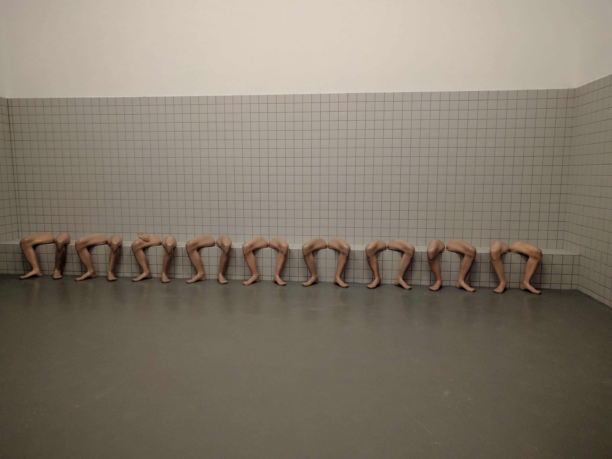
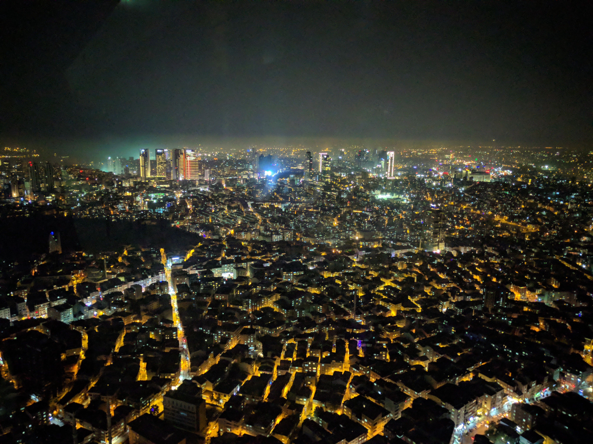

I wanted to visit Istanbul 3 years ago and even told my friends about it, but 2 years after that moment, I didn’t really want to travel anywhere anymore because in my opinion, the Internet (even if it’s not decentralized) saves us money & time and so we don’t really need to travel anymore, I buy all my stuff online on Ebay, I work remotely at Obytes as a front end engineer, I learn at Udemy or YouTube, I read articles on Medium, Dev & Codementor, I watch movies/series on Netflix & I attend any event or conference via YouTube or Facebook live….

Which is why I think we don’t really need to travel anymore but that doesn’t make me wanna stay in Morocco due to many reasons and the most important one is the lack of funding & a bad educational system. But I wanted to really experience travelling to see if it’s really worth it. So as a nerd obviously I have to get prepared using tech, so here are the stuff I used to get ready, walk around…:

- Google trips: https://get.google.com/trips/.
- Booked my Hotel room on Booking.
- Downloaded Uber & Istanbul offline map.
- Booked my flight via: Google flights.
- Packed up my laptop/Phone/GoPro/headset/earphones/cables etc…

First time taking a flight, I coded at the airport for the first time, the flight was nice during take off but sucks during landing! once arrived at Istanbul, I exchanged a little amount of money and booked an Uber directly to the Hotel. After checking out social media & the room, I got to sleep. As I’ve already marked the places I wanted to visit there on Google trips, I got up the next day and went outside (and yeah I went alone and got an idea to make this shirt), tl;dr I walked around Taksim square, boat tour, ate Chawarma & got back to my hotel. Here are some pictures I took.

Day 3: I went to checkout the Startup Istanbul conference, the first day was boring so I won’t talk about it but rather I’ll jump into Day 4 when I went to check more places out! tl;dr here are the pictures I took there:

Nothing special happened and I didn’t really enjoy walking around, as you can tell I kept simply taking pictures with my Nexus 6p, I was impatient getting back to my room to learn Angular Js which I was learning during this travel. on my way back to the hotel, I visited this weird modern museum and took some pictures.

Day 5: was the second day of the conference which I actually enjoyed because they brought Tim Draper & some folks from 500 startups & YC who declined I & my friend’s application to Winter 2018 program, they kept speaking about the blockchain, ICO & Ai.

At that night I met with some great people, one of them was also from Morocco and so we visited a nice place & viewed Istanbul in 3D.

Day 6: was the day before the last day there in Istanbul and so I woke up early, took my breakfast & went back to that view to take more pictures.

Day 7: I prepared my stuff and booked an Uber directly to the airport, the driver got a tip from me & was so happy, funny they check the laptops too in the airport, I spend some time coding at the airport again and then got back to Morocco.

You can check out all the pictures I took [here](https://unsplash.com/@smakosh)

    <iframe width="560" height="315" src="https://www.youtube.com/embed/3ixSvX5-Nsw" frameborder="0" allow="encrypted-media" allowfullscreen></iframe>

I learned to never go on vacation again, stay inside my room & learn to build useful products.
