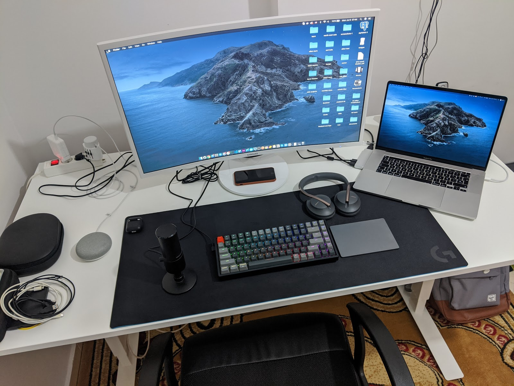

A list of tools I use wether for:

- Personal side projects
- My full time job
- Or working with clients

## Design tools

- [Adobe Illustrator](https://amzn.to/2Ygdmek) for logo, icon and illustration design
- Adobe XD for designing user interfaces & wireframes
- [Photopea](https://www.photopea.com/?ref=smakosh.com) for editing pictures & memes
- Final cut pro for editing videos
- Dribbble/Behance for inspiration and work showcase.

## Code

The code editor I'm currently using is VSCode

I share my code & look for inspiration on:

- GitHub
- Codepen
- CodeSandbox

If I’m simply coding an interface that I might integrate into a web app I use plain HTML/CSS & vanilla JavaScript.

But if I'm working on a landing page, documentation website, blog or even a large web app I use:

### Primary stack

- The JAM stack:
  - Gatsby or Next
  - Serverless functions written in JavaScript (when required)
  - Headless CMS (when required)
  - Markdown, Yaml, Json etc... (when required)

> Have used Jekyll and Pelican before

For CSS, I’m cool to use what ever tech available out there that makes my task done quickly & well, I have personally used Bootstrap 3 & 4,Bulma, Lostgrid, Materliaze, skeleton, tailwind, Tachyons & made my own micro CSS framework called [Unnamed](https://unnamed.smakosh.com/) that has over 200 stars on GitHub, but I prefer coding with vanilla CSS or CSS in JS using styled-components or CSS modules, because I enjoy styling my elements from scratch since the components are fully reusable with React.
I have used Theme UI and styled-system as well, I do think they are good and useful and I do recommend them.

### Secondary stack

- MERN stack:
  - MongoDB
  - Express
  - React (CRA)
  - Node Js

The MERN stack is my secondary stack for building web apps

> I made my own [boilerplate](https://github.com/smakosh/personal-react-app-boilerplate) to handle that which actually needs to be updated ASAP

I use Git bash as my terminal when I’m on windows, iTerm2 with "oh my zsh" themes when I’m on macOS.

For the backend, I was using PHP/MySQL which I didn’t personally like, so I switched to Node js meaning that I currently use Express Js/Mongoose and Mongodb as a NoSQL database to make Restful APIs which I deploy on Heroku if it was a mvp and on a Digital Ocean droplet when it's a fully working product

> I made my personal [boilerplate](https://github.com/smakosh/rest-api-boilerplate-v2) to speed up that process.

### Optional stack

This can be part of the JAM stack

> the "A" part on JAM which stands for APIs

- Firestore
- FaunaDB
- Firebase auth
- Auth0
- ...

### Mobile stack

- React Native
  > I have used Ionic before

For native apps, I use React native to build mobile apps (Ios & Android). I also have a personal [boilerplate](https://github.com/smakosh/RN-personal-boilerplate) that I use to speed up the process.

### Deployment

- Vercel using their GitHub intergration or the Vercel CLI
- Digital Ocean in a manual way
- App Store / Play Store using Fastlane

## Growth

For growth, I focus more on building useful products that users really need in their lives then I simply share it on this blog, Product Hunt, Hacker news, Reddit and on social media.

## Setup

### Laptop

> Personal

- [MacBook Pro 2019 16"](https://amzn.to/2OyMC62)
  - Display: 16" retina screen
  - CPU: 2.3 GHz 8-Core Intel Core i9
  - GPU: Intel UHD Graphics 630 1536 MB
  - Ram: 16 GB 2667 MHz DDR4
  - SSD: 1 Tb

### Equipment

- Monitor: [Samsung Curved monitor](https://amzn.to/2s8OjyC)
- Keyboard: Keychron K2 keyboard RGB brown keys
- Main Headset: [Bose Noise Cancelling Headphones 700 + Charging Case](https://amzn.to/2ODY7cC)
- Secondary headset: [Razer Kraken Pro](https://amzn.to/2LiN1c4)
- Earphones: [Apple Airpods](https://amzn.to/2PtHmR3)
- Microphone: [Razer Seiren X](https://amzn.to/38jk1dj)
- Desk: Skarsta Ikea desk (adjustable height)
- Mouse: Apple Magic trackpad 2 gray
- Mousepad: Logitech G840 XL GAMING MOUSEPAD

### Phones

- For Android, I'm using the Google Pixel 2 with a Dbrand dragon skin
  - Android 11
- For iOS, I'm using the Iphone 7
  - iOS 14

Previously, I was carrying only a Nexus 6p which I had to stop using due to these [reasons](/pixel-2-review-and-why-Nexus-6p-is-a-bad-choice)

### Cameras

At the moment, I'm only carrying with me a [GoPro hero 7 black edition limited edition](https://amzn.to/2X5rw5A)

### Ai assistant

Currently, I'm using a Google home mini

### VR

[Google VR 1st gen headset](https://amzn.to/2XbPLiv)

Full setup with pictures can be found [here](https://docs.google.com/document/d/1falYEEHhJxq4HIXwOPoc4lk0AYsfHY4U6ZCcY4Srs8g/edit?usp=sharing)
