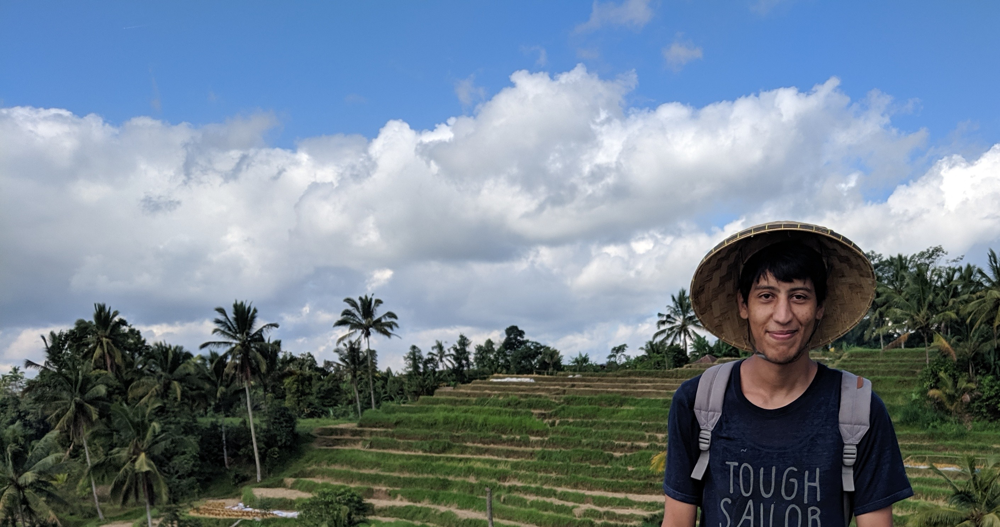
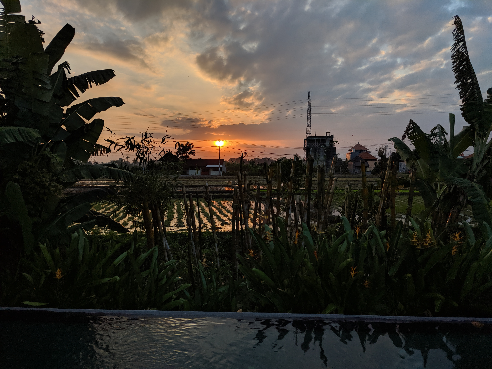

I'm writing this article in my room back home, thankfully I arrived safely and I had to take some rest by calling on my grandma in a not so far village from my small city.

Before Bali, [last time I was in Penang where I shared my monthly experience there](/penang-was-way-better) and I made sure not to forget anything important to help you out.

## Planing

I didn't plan to visit Bali after Penang, but I couldn't resist since it was nearby and I wanted to go there since I've seen [this prediction from Arthur C Clarke in 1964](https://youtu.be/wC3E2qTCIY8) about being able to work remotely from Bali, so I decided to spend 15 days there.

## Flight (rebound)

I booked my flight from Penang to Bali via Singapore, then the return flight from Bali to Kuala Lumpur via Singapore again, you might have guessed the airlines correctly, if not it was Singapore Airlines, one of the best airlines with a large and amazing airport.

Since I got earlier to the airport, they offered me if I want to take the next flight instead of waiting for my flight, I agreed and I got extra 4 hours to spend in a productive way at Singapore airport.

> Te total cost of the flight was about ~ $440

## Housing

As you might know, Bali has 3 most known areas, Denpasar, Ubud & Canggu, almost no tourist stays in Denpasar as it's nearby the airport and it's full of companies and people who work there, most go to stay in Canggu, I preferred a more natural environment and that's why I stayed in Ubud, I booked a [traditional wood house](https://www.airbnb.com/rooms/18625567) with a swimming pool nearby, it cost me $192.92 for 15 days. The other reason of my decision is a nearby co-working space called Dojo Bali which wasn't that far from my stay.

## Transportation

If you don't have a suitcase, don't bother riding a taxi or booking a grab car when you get out from the airport, the cheapest way is to book a grab bike or Go-Jeck bike to get you out of Denpasar, in my case, I was carrying my suitcase with me, so I had no other choice than booking a taxi as it was too late and couldn't wait for the Grab driver to get to the airport.

the day after, I booked a bike for $20/week at [Bali Transport Motorbike Rental](https://www.google.com/maps/place/Bali+Transport+Motorbike+Rental/@-8.5298499,115.2618019,17z/data=!3m1!4b1!4m11!1m5!8m4!1e1!2s105998720729319403773!3m1!1e1!3m4!1s0x2dd23d9cc03c030f:0xfa11da049cd107cb!8m2!3d-8.5298552!4d115.2639906).

It was the first time I drive such a scooter, it was automatic and it was easy to learn how to drive it, you do require an international driving license to drive it which I didn't have, but because I look like an Indonesian, I don't speed up and I used to wear my helmet all the time, the police didn't suspect me.

Be careful driving it during early mornings, make sure the breaks are working and recognize/memorize where each break is, the reason I'm telling you this is because I did fail during an early morning while going back home, the floor was wet and I forgot that the left handle was controlling the front brakes, so I slipped with my scooter, the injuries weren't that dangerous and one Balinese guy checked if I was doing fine and he kindly guided me to a nearby hospital to fix my injuries.

That didn't stop me from going around riding my scooter at all, but that taught me to be careful.

  <iframe width="560" height="315" src="https://www.youtube.com/embed/8WNtvOoCm_M" frameborder="0" allow="encrypted-media" allowfullscreen></iframe>

## Work

For work, I used to go to Dojo Bali co-working space, I prefer working from home, cafes and co-working spaces because I'm surrounded by strangers and they never bother me while working which I really like.

  <iframe width="560" height="315" src="https://www.youtube.com/embed/5ZEirx48wO0" frameborder="0" allow="encrypted-media" allowfullscreen></iframe>

> I paid $120 for 120 hours

## Weather

The weather in Bali depends on the season, I'm not sure how is it on the other seasons but during my stay, it was hot but really not as hot as in Malaysia. The same applies to the rain, it wasn't raining all the time like in Kuala Lumpur.

## Tourism

### Natural spots

I visited all these places

- Luwak Cafe
- Bali Swing
- Batu Bolong Beach
- Monkey Forest
- KelingKing, Broken and Crystal Beaches
- Rice Field

You can check out the pictures on my Unsplash account, I made a collection just for Bali: https://unsplash.com/collections/4956614/bali-indonesia

KelingKing beach is located in Nusa Penida, I will write a separate article about that experience and how can you get there as well if you're in Bali or planing to visit it. So make sure to subscribe to the news letter to be amongst the first ones to get the article delivered to you as soon as it's published.
