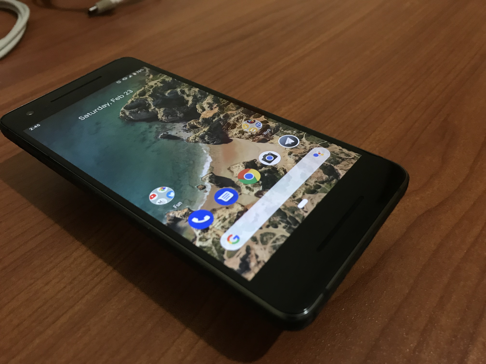
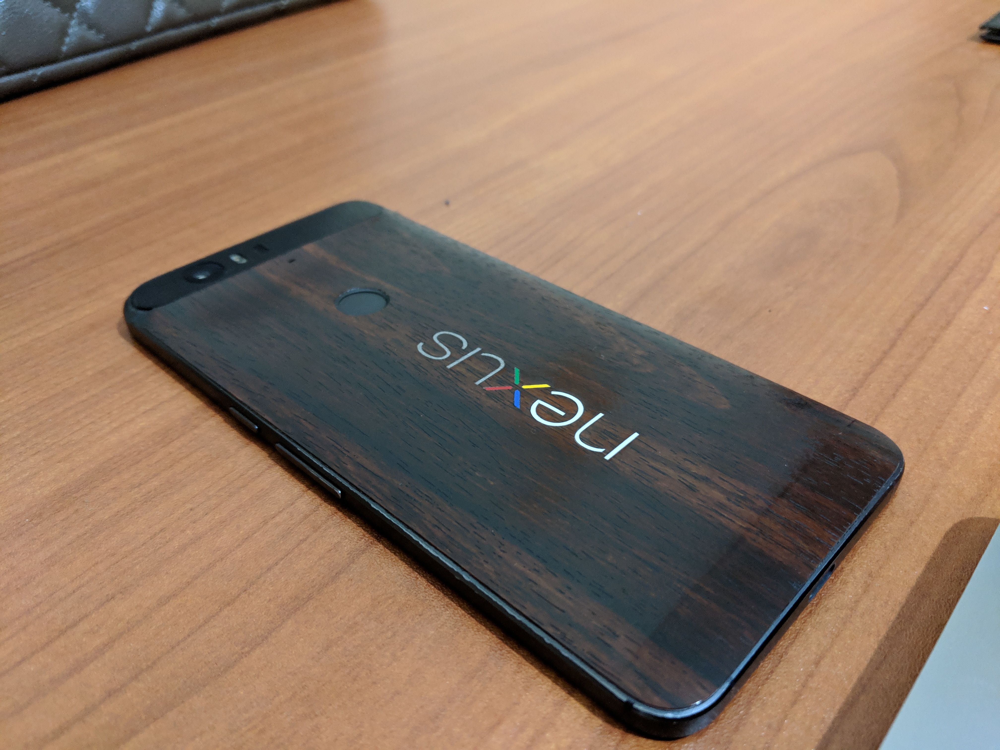
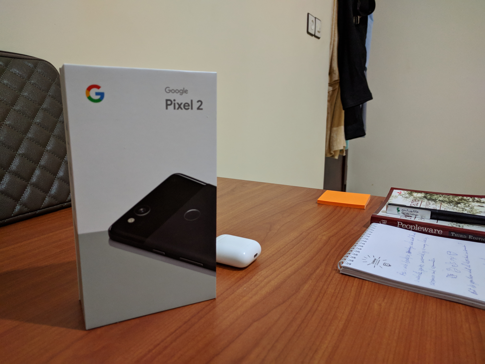
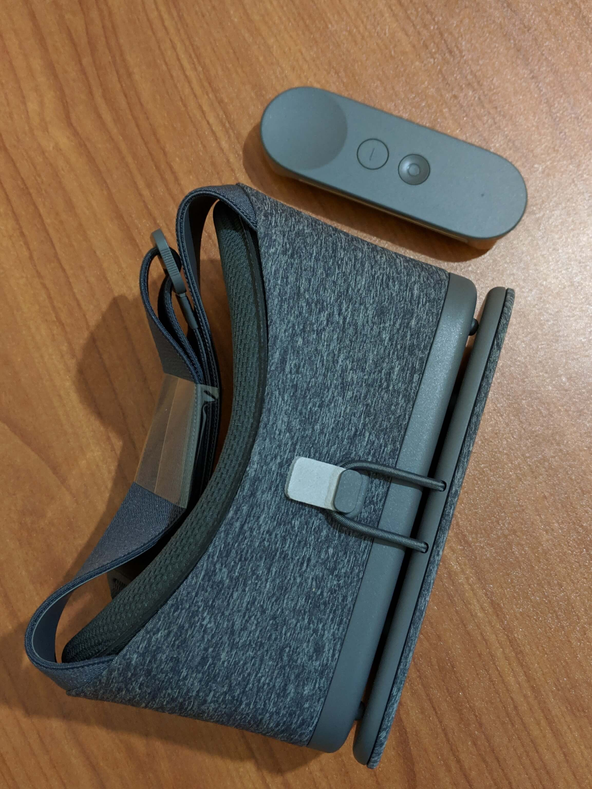

I've been using the Nexus 6p for 2 years until recently as I had to upgrade to the [Google Pixel 2](https://amzn.to/2NX1JXq) for various reasons which are really frustrating to a level that I highly don't recommend buying the Nexus 6p.

I'll walk you through the pros & cons of the Nexus 6p real quick before I move on to the Pixel 2.

## Camera

Nexus 6p has a really good camera with the Google camera app built in that shots some great pictures combined with HDR, your photos will look amazing (see [examples](https://unsplash.com/@smakosh)) but that uses a huge power of your battery power & your phone will end up shutting down in a short period of time.

## Build quality

The build quality is good but keep in mind that it's a big phone that you will need two hands to use otherwise your hand will eventually get tired of using it and it hardly fits in your pocket 😅.

## Battery

One of the main reasons I don't recommend buying this phone, it has battery issues which you will notice after few months of using the phone, the most frustrating thing is when it shuts down at 20% which gets really annoying over time.

## Performance

Since it's rocking the stack android, you can delete the default apps if you don't use them and the user experience is nice & never gets slow while using it, the phone gets really hot though when you're watching a long video or playing some games that require huge computational work.

## Display

The display is a 2k LED screen with huge bezels on all sides with large ones on top & bottom.

Enough with the Nexus 6p for now and let's jump into the [Google Pixel 2](https://amzn.to/2NX1JXq) now which most of my [Instagram](https://www.instagram.com/smakosh19/) community has voted more for its review.

> Keep in mind that I’m reviewing the Pixel 2 and not the Pixel 2 XL.

I've been using it for a couple of months so far and I'm really satisfied with my decision of purchasing it!

## Camera

It does take amazing pictures, the portrait mode is epic and provides both the normal picture and the one with the blurring effect, it has the night sight mode that helps take good looking photos without the need to activate the flash.

## Portrait mode

## Night sight

## Build quality

It's a small one hand phone, light & fits right in my pocket, has rounded edges on the back unlike Nexus 6p.

> I had to apply the Dbrand dragon skin to avoid getting my fingerprints all over it.

## Battery

Has a 2700mAh battery that works really well and holds for a day of use while:

- taking pictures
- listening to music with bluetooth enabled
- Data usage enabled
- Instagram, Twitter, Telegram etc...

## Performance

Doesn't get hot at all even after using it for a long period of time, supports and works fine with the Google Daydream VR headset.

## Display

It's an AMOLED display with a full hd screen resolution.

## Bonus

Pixel 2 is water resistant, doesn't have an audio jack, has unlimited photo storage and will get upcoming Android updates.

> Forgot to mention that both phones have a fingerprint sensor on the rear.
