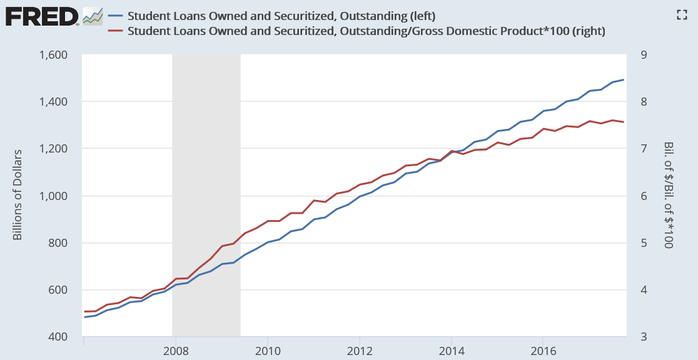

## Life update

If you haven't read my [previous article about the visas rejections](/visa-rejections-stories), I'd recommend you to do so as I mentioned there that I switched my job and the reasons behind such decision.

## Caution

⚠️ Please be aware that this doesn't apply or might not work for everyone, luck and other factors play a huge role in this to workout and I'm grateful for being very lucky that it did.

### Students loan debt

We all know and aware of the student loan debt issue in the US, it exceeded \$1.2 trillion in 2014 according to [Wikipedia](https://en.wikipedia.org/wiki/Student_debt#Statistics).

Middle class families are the most impacted ones, as a result, most end up having financial issues even after the graduation of their kids, same applies in other countries but differently.

> you could do your own research for the reasons and causes behind the issue

### Avoiding student loan debt

I will share the approach I took but keep in mind that there are other better and bad approaches, I don't recommend any and I'm just sharing my experience. And keep in mind that I'm based in Morocco which offers the option of a low cost education and you're not forced to study at private schools.

What I basically did is working with international clients while I was studying in a public school after high school, what I could learn today, will apply it tomorrow in exchange of cash. But I had to learn most of the stuff at home as I mentioned in [my previous articles](/visa-rejections-stories).

> I had to sleep at 4am most of the time.

I kept following that approach but in an exponential way when it comes to the technical side of the work I was doing, meaning that I've almost never done something repetitive and I try to learn to use something new when ever I get a task to work on.

## FAQ

I'm pretty sure most of you will be questioning these questions:

But how would you get those clients without any work to showcase?

- I followed few tutorials, made an Intro using After Effects, posted it on YouTube, a videographer based in Canada left a comment which turned into a work I had to deliver.

From making the same intro into making 2 brand logos for him and that's how this started. TL;DR, worked on my personal projects, showcased them and that's how it launched.

Based on what do you know what to learn next?

- I've been up to date on what's happening on the web community, I bet entirely on JavaScript and CSS, few factors contributed in that, which made me take that decision, here are a list of those factors:
  - A friend of mine
  - I started learning the front-end first
  - The rise of Node js that made JavaScript the first cross-platform language
  - It wasn't taught and fully neglected by our educational system, which meant more chances of landing a job in the future.

> If you have more questions, you can add a comment below or DM me on [Twitter](https://twitter.com/smakosh)

## Why working at a startup?

> This is a part 2 of [this article](/one-year-working-remotely)

My second year of working remotely was so fun & hard as I had a part time job as a React Native developer, working a total of 12 hours a day.

I've been learning React Native on my spare time during the first year while working for Obytes, I had built and shipped few Android & iOS apps.

> Notice the pattern? Build your own projects, showcase them with your skills and that eventually will contribute in landing a job.

As I was living in my parents basement, it was like getting funded by a Startup to learn and acquire new skills, I didn't care about the financial side at all but focused on learning and acquiring knowledge.

> [It was honestly like a seed investment with unlimited runway](https://twitter.com/smakosh/status/1211686250782040064)

## When to exit?

As few startups exit (sellout) aka getting acquired by a large company, I did the same at the right moment as I've learned a lot compared to someone who has just graduated and joined a company.

I had to decline many offers during those 2 years, even if they were offering double and triple the salary I was getting, I never mentioned them to anybody including my family as they'd most likely influence me to accept them.

I had to support ageism and bullshit comportement of a board member working at the startup, until the time was right to exit and I resigned.

## When not to exit?

If I got the stock options I was offered by one of the board members and if they were valuable, I wouldn't have quit especially if:

- The startup was about to get acquired by a large corporation
- The startup was highly profitable

Otherwise, those assets will be considered just like an annual bonus.

> Avoid getting brainwashed at all costs.

## Conclusion

I would have taken other approaches and done things differently to end up with better results but let's leave that to an upcoming article on which I'll try to send a letter to my past self.
