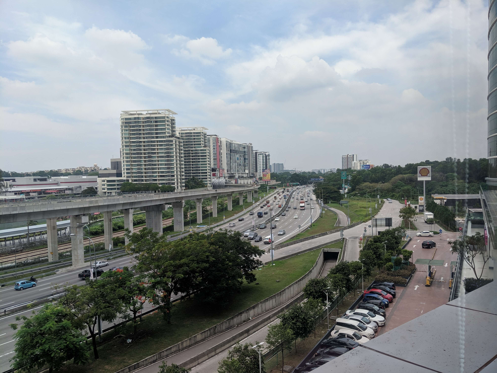

I won’t consider myself a digital nomad yet, but I admit that I was a bit influenced to try out that lifestyle, but as I don’t like traveling a lot as I mentioned in my [previous article](/istanbul-trip), I wasn’t really engaged into the idea of continuously traveling & working remotely from anywhere as I’m not sure if I would be able to focus in that way.

Personally, I prefer to settle down in one place for a long period of time to focus, plan, acquire & practice new skills before I move on to another place.

Therefore, I decided to spend the longest period of time in a country in Southeast Asia that doesn’t require any visa as I seriously hate bureaucracy and I'm too lazy to prepare any necessary documents. After searching on the web, I chose to travel to Malaysia in order to spend 3 months there (2 months and 17 days to be precise), I knew that Kuala Lumpur’s weather wasn’t healthy, so I decided to spend the first month there, then move on to Penang Island for the second month then finally get back to KL to eventually move back to my home country.

I actually had other ideas, like going to Bali to spend half of the second month there, but due to Bali’s weather, I decided to spend the whole second month in Penang.

So as a remote developer, I’d like to share my experience of spending a month here in KL with you covering most of the parts that you might worry about before coming here.

> There will be an upcoming article about Penang Island as well, make sure to subscribe to the news letter in order to get my latest articles delivered right to your inbox!

## Planning

Before you start packing your stuff & booking your flight, you must plan everything way earlier in order to avoid touristic seasons, so don't rush things out and don't forget to check the weather as well, in my case I had planned to get here since January, I targeted the season in between April & June as after June, everyone is in holidays and the area becomes so touristic and the cost of living raises way higher than during the normal seasons.

## Flight (rebound)

I made a mistake booking my flight late, I should have booked a couple of months earlier to get the price down in between $ 500 - $ 700 from Casablanca, Morocco to Kuala Lumpur, Malaysia instead of the actual price I paid which was in between $ 800 - $ 900 with Oman Air. I had to change the plane in Muscat, Oman. Same when I'll be returning back home.

## Housing

The second thing you will look up to is housing, feel free to use what ever you think is better for you, in my case I used [AirBnb](https://www.airbnb.com/c/ismailg745?currency=USD) to book the first month in Shah Alam which is far from KL's center as I wanted to focus on my work & personal side projects a lot more.

Because I rented away from KL's center, the rent cost me approximately ~ \$ 330 for the entire apartment.

You can have a look at the place by visiting [this link](https://www.airbnb.com/rooms/16269315?guests=1&adults=1)

## Cash

Malaysia is known as a cash only country so you should consider bringing some cash with you along the way, but you can still pay few services like commuting, food, mobile data top up and few more with your credit card.

## Transportation

Now that you've planned everything, booked your flight and exchanged your money, the first thing that comes in mind is transportation and obviously the first thing you will find online is the numerous warnings to avoid taxis what so ever, as they are expensive and they offer touristic prices & I do confirm that is true.

You might have read that you can use Grab as it is the popular ride sharing mobile app in Southeast Asia, but if you ever ran into the same issues I ran into, which were that Grab wasn't working properly and it couldn't verify my selfie nor accept my credit card and didn't let me book a ride with a Malaysian phone number.

In that case, there are alternatives, like a competitor app called myCar which simply offers the same service for a lower price.

As for other kind of transportation, KL has 5 different trains/subways that operate in different areas in the city, they are the best to commute for long distances.

## Work

Maybe the place you booked doesn't have a nice chair, fast Wi-Fi or a comfortable desk, no worries, KL has many awesome co-working spaces that you can work at, in my case I worked few times from [Worq](https://worq.space/coworking-space/subang/) co-working space located in UOA Business park near Subang Jaya KTM station, it's not cheap but it's worth it if you love working within a group of strangers. Starbucks are everywhere you go as well, fully equipped with outlets but few only have fast Wi-Fi, fortunately for me, my host offered me a Hotspot pocket Wi-Fi that I can carry with me anywhere I go.

## Tourism

During the weekends, I used to visit some touristic spots and maybe you'd love to check them out as well, I made sure to take some shots of all the spots I visited and everything is available on my [Instagram account](https://www.instagram.com/smakosh19/) and you can download them on my [Unsplash account](https://unsplash.com/@smakosh) for free.

I personally prefer natural & traditional spots but I made sure to cover modern ones as well for the sake of my family, friends and followers on social media who might prefer to visit them in the future.

## Weather

KL feels pretty hot than the actual degree you might see online or on weather channels, It's more hot than my home city where it's sometimes up to 40°C. Air conditioners are everywhere which makes the city pretty noisy, if you're that type who likes peaceful & calm places, KL is the wrong place to go to.

## Internet

Internet is fine but not sure if you will be able to live stream or upload smoothly, but you can use 4G which I end up doing as well, you can get a local SIM card right at the airport, then top up online or from any nearby store.

### Modern spots

- Petronas Towers (Make sure to check online if they are not in maintenance mode)
- Menara KL Tower (costs about \$ 24 to get to the top level and get into Skybox)
- Upside down house (just before you get to Menara KL Tower, forgot how much it costs)

### Natural & Traditional spots

- Batu caves (Free)
- Thean hou temple (Free)
- Taman Tasik Shah Alam Park

And that summarizes everything I wanted to share with you, I didn't mention food and many other things to make the article as short as possible and I'm sure there are other online articles and videos that dig deeper in the other things you might want to know about.
