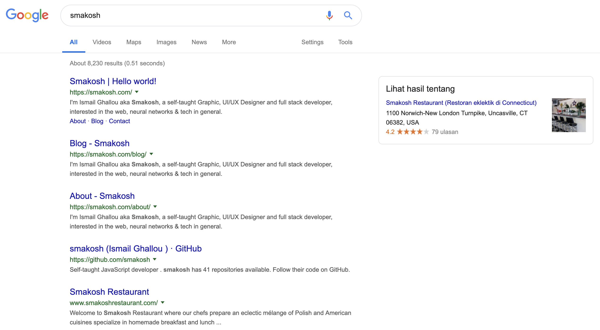

I have landed successfully in Bali, rented a scooter and been enjoying my ride from my place to Dojo Bali where I'm currently writing this article.

## SEO definition

Search engine optimization (SEO) is the process of increasing the quality and quantity of website traffic, increasing visibility of a website or a web page to users of a web search engine.

> Taken from Wikipedia

## The SPA issues with SEO myth

All React apps built using CRA (create-react-app) or Gatsby to serve dynamic content are single page apps, meaning that there is one index.html file that renders the content of your app, which means that all your meta tags within your components won't be crawled for indexing on search engines, or it used to be! As of May 2019, [Google announced](https://webmasters.googleblog.com/2019/05/the-new-evergreen-googlebot.html) that its crawler can now crawl JavaScript just like the Twitter/Facebook/Slack/Telegram crawlers, so when ever a non technical person mentions this SPA SEO myth, make sure to enlighten them.

## What we used to do before crawlers turned out to be able to crawl JavaScript

Most React developers used Next Js as it offers server side rendering, meaning that the pages are generated on demand when the user visits a certain url or use a technique called Pre-rendering which is basically server side rendering during build time, Gatsby still uses this approach to generate the pages for your static content but doesn't offer that feature for dynamic content unlike some services such as Netlify that offers pre-rendering for your dynamic content.

## SEO component

Inspired from [this GitHub repository](https://github.com/joshbuchea/HEAD) which contains all you need to include in your header tag, I made this SEO component that I re-use almost on all my Gatsby/React apps to handle SEO

> I added few comments within the code explaining each part

```jsx
import React from 'react'
import Helmet from 'react-helmet'

// This is the thumbnail that appears when someone shares your website
import Thumbnail from 'assets/me.jpg'
import {
  url,
  defaultTitle,
  defaultDescription,
  social,
  socialLinks,
  address,
  contact,
  legalName,
  foundingDate,
  logo,
  author,
} from 'data/config'

export const SEO = ({
  title,
  type,
  description,
  articleBody,
  datePublished,
  dateModified,
  cover,
  location = '',
  readTime,
}) => {
```

I had to separate the snippets for a11y concerns

```js
// This is Structured data that is recommended to have according to Google
// You can read more about it on Google's own documentation about structured data
// The first string is for the Article schema and the second one for the organization schema
const structuredDataArticle = `{
		"@context": "http://schema.org",
		"@type": "${type}",
		"mainEntityOfPage": {
			"@type": "WebPage",
			"@id": "https://google.com/article"
		},
		"headline": "${description}",
		"image": "${
      cover ? `https://smakosh.com${cover}` : `https://smakosh.com${Thumbnail}`
    }",
		"datePublished": "${datePublished}",
		"dateModified": "${dateModified}",
		"author": {
			"@type": "Person",
			"name": "${author}"
		},
		"articleBody": "${articleBody}",
		"publisher": {
			"@type": "Organization",
			"name": "${author}",
			"logo": {
				"@type": "ImageObject",
				"url": "${logo}"
			}
		},
		"description": "${description}",
		"url": "${url}${location}/?ref=smakosh.com"
  }`
```

```js
const structuredDataOrganization = `{
		"@context": "http://schema.org",
		"@type": "${type}",
		"legalName": "${legalName}",
		"url": "${url}",
		"logo": "${logo}",
		"foundingDate": "${foundingDate}",
		"founders": [{
			"@type": "Person",
			"name": "${legalName}"
		}],
		"contactPoint": [{
			"@type": "ContactPoint",
			"email": "${contact.email}",
			"telephone": "${contact.phone}",
			"contactType": "customer service"
		}],
		"address": {
			"@type": "PostalAddress",
			"addressLocality": "${address.city}",
			"addressRegion": "${address.region}",
			"addressCountry": "${address.country}",
			"postalCode": "${address.zipCode}"
		},
		"sameAs": [
			"${socialLinks.twitter}",
			"${socialLinks.google}",
			"${socialLinks.youtube}",
			"${socialLinks.linkedin}",
			"${socialLinks.instagram}",
			"${socialLinks.github}"
		]
  	}`
```

```jsx

  return (
    // Notice I'm using react-helmet to inject these elements within the header tag
    <Helmet>
      {/* The description that appears under the title of your website appears on search engines results */}
      <meta name="description" content={description || defaultDescription} />

      {/* The thumbnail of your website */}
      <meta
        name="image"
        content={cover ? `${url}${cover}` : `${url}${Thumbnail}`}
      />

      {/* Opengraph meta tags for Facebook & LinkedIn */}
      <meta property="og:url" content={`${url}${location}/?ref=smakosh.com`} />
      <meta
        property="og:type"
        content={type === 'NewsArticle' ? 'NewsArticle' : 'website'}
      />
      <meta
        property="og:title"
        content={title ? `Smakosh | ${title}` : defaultTitle}
      />
      <meta
        property="og:description"
        content={description || defaultDescription}
      />
      <meta
        property="og:image"
        content={cover ? `${url}${cover}` : `${url}${Thumbnail}`}
      />

      {/* You can get this id when you create an app id on Facebook of your Facebook page */}
      <meta property="fb:app_id" content={social.facebook} />

      {/* These tags work for Twitter & Slack, notice I've included more custom tags like reading time etc... */}
      <meta name="twitter:card" content="summary" />
      <meta name="twitter:creator" content={socialLinks.twitter} />
      <meta name="twitter:site" content={social.twitter} />
      <meta
        name="twitter:title"
        content={title ? `Smakosh | ${title}` : defaultTitle}
      />
      <meta
        name="twitter:description"
        content={description || defaultDescription}
      />
      <meta
        name="twitter:image:src"
        content={cover ? `${url}${cover}` : `${url}${Thumbnail}`}
      />
      {type === 'NewsArticle' && (
        <meta name="twitter:label1" value="Reading time" />
      )}
      {type === 'NewsArticle' && (
        <meta name="twitter:data1" value={`${readTime} min read`} />
      )}
      {type === 'NewsArticle' && (
        <meta name="author" content="Ismail Ghallou" data-react-helmet="true" />
      )}
      {type === 'NewsArticle' && (
        <meta
          name="article:published_time"
          content={datePublished}
          data-react-helmet="true"
        />
      )}

      {/* Structured data */}
      <script type="application/ld+json">
        {type === 'NewsArticle'
          ? structuredDataArticle
          : structuredDataOrganization}
      </script>

      {/* Not sure if this is still relevant as Google shut down their Google+ paltform */}
      <link rel="publisher" href={socialLinks.google} />

      {/* The title of your current page */}
      <title>{title ? `Smakosh | ${title}` : defaultTitle}</title>

      {/* Default language and direction */}
      <html lang="en" dir="ltr" />
    </Helmet>
  )
}
```

And I include it on each component that is meant to act like a page like so

```jsx
import React from 'react'
import SEO from './SEO'

export default () => (
  <div>
    <SEO title="Home page" location="/" type="Organization" />
    <h1>Home page</h1>
  </div>
)
```

> You can get this component from the code source of this blog.

## Tips & tools to rank your website higher on search results

If your website is a blog like this website, it's highly recommend to have a RSS feed like [this one](https://smakosh.com/rss.xml) as some apps and extension do crawl the feed and will bring you more visitors that will boost your ranking on search results.

Having a sitemap helps as well and you have to submit it to your [Google Search console](https://search.google.com).

> You can test your structured data [here](https://search.google.com/structured-data/testing-tool)

Feel free to drop your questions down in the comments section and I'll do my best to answer them all.
