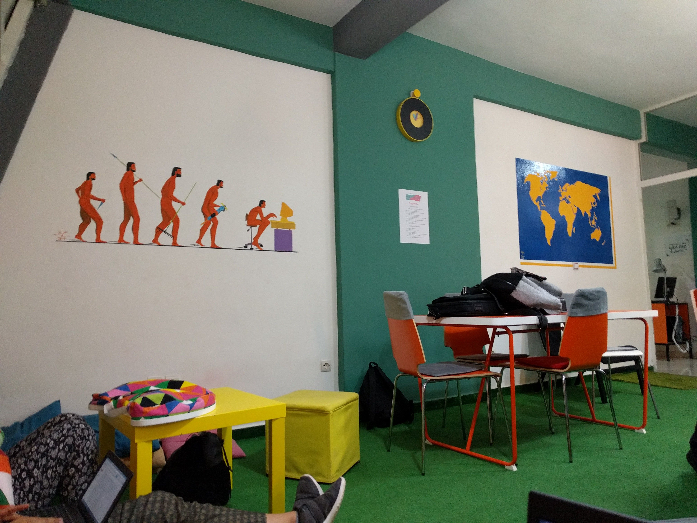
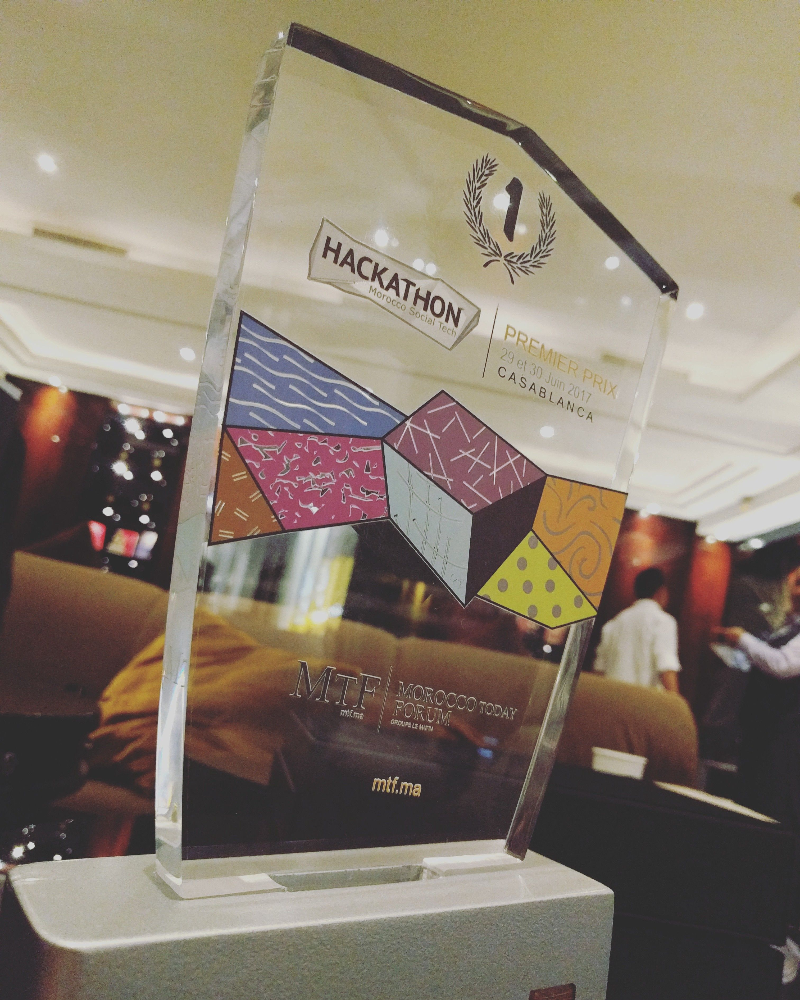

As I always do, to arrive at time I stay awake the whole night, so I spent that night coding & designing like most of my days.
So after [I declined the job offer](/getting-my-first-job-offer), I was invited once again to participate in a great hackathon organized by [Lematin](https://lematin.ma) by partnering with Screendy, but this hackathon was a bit serious since they invited only ideas holders at the beginning to select the good ones, then they invited us : designers, developers & marketers to help them make a prototype.

The event took place in [Smart Center](https://smartcenter.ma/), a great co-working place which I recommend you to visit if someday you visited Casablanca city, Morocco.

Anyway as every other hackathon, the CEO of Lematin introduced & declared the start of the hackathon, ideas holders started pitching their ideas so that we choose the one idea we got interested in, so once I heard the COOP 360 idea from a great guy, I immediately asked him to join the team as a designer & developer as the same time & he accepted instantly after showing him off my works.

Since it was an E-commerce platform I had to use my own github repo — https://github.com/smakosh/Smartshop — of a starter kit E-commerce app built with php/mysql — yeah it lacks many things but it does the work as a prototype — anyway I started designing the logo, illustrations, changing sass color variables & adding more pages since we needed more features because it wasn’t only an online shop, I didn’t sleep since I was focused on finishing that prototype, after 36 hours non stop of work, the jury then came in and projects’ holders started pitching their ideas with a demo of the prototype.

To be honest I didn’t believe that we were going to win as I told my friend that we wouldn’t win this when the Jury was about to announce the winners of the first prize, but yeah I was wrong, we actually won & got invited to assist to a conference where we’ll receive our prizes.

[News coverage](https://lematin.ma/express/2017/remise-des-trophees-aux-gagnants-du-hackathon-laquo-morocco-social-tech-raquo-/274777.html)

As a conclusion, what I really learned during this hackathon is to never give up and just do your best & go beyond your obstacles!!
