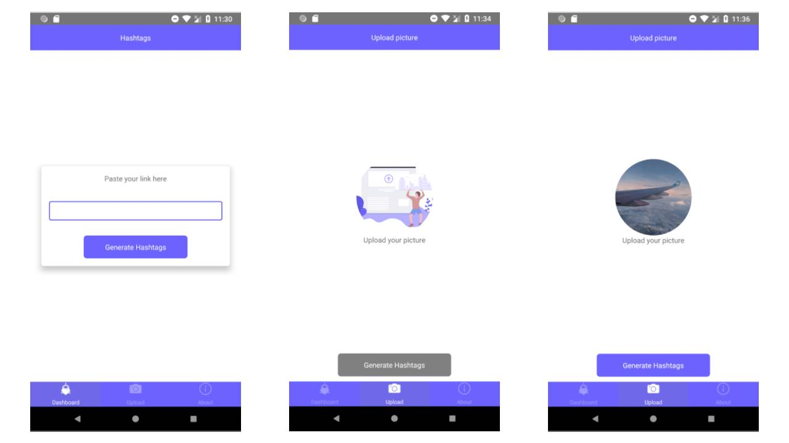

Hashtag ~hashtags is the plural noun~ is any phrase or word that has a '#' sign at the beginning, it is mostly used on social media platforms to target a specific topic and to gather users interested in that same topic.

As we're targeting "hashtags" as a topic, you could use the "#hashtags" hashtag as the topic of this article.

hashtags themselves have no issues so far but the way few users use them, whether they are overusing or faking them, at the end all users will get annoyed, like when you're scrolling through posts related to "tech" for example and you end up finding lot of unrelated posts, doesn't that annoy you?

The same goes when you're trying to read someone's post's description but it's full of hashtags they overused, that's why it's better to have some line breaks or put them as the first comment.

the overusing of hashtags issue has been solved by few platforms, by warning the user and eventually banning them, unlike the issue of using unrelated hashtags, it hasn't been solved yet, that's why I built [Ai Hashtags](https://ai-hashtags.com/?ref=smakosh.com) in order to solve it!

Ai Hashtags generates hashtags using Artificial intelligence, and here's how it works:

1. Upload your picture or paste the link of your Instagram post
   
2. Hit Generate hashtags button
3. Select specific hashtags to copy or copy them all
   
4. Paste them into your post

The app has English, Spanish, simplified Chinese & Arabic languages, currently it is available on the [Play Store](https://play.google.com/store/apps/details?id=com.aihashtags) only, but the iOS app has been built and Apple is currently processing my purchase of the developer account.

This was a fun project to work on and the reason I built it goes way back when I & my team [won the second prize of the online JAMStack FreeCodeCamp Hackathon](https://medium.freecodecamp.org/winners-from-the-2018-freecodecamp-jamstack-hackathon-at-github-2a39bd1db878), we used [ClarifAi](https://clarifai.com) API to automatically generate hashtags from the pictures of the products you're trying to sell, so that you could easily share it on Social media and gather actual users who are interested in that specific product. ClarifAi let me use their community API Key that offers generously the first 5k requests for free, then I'll have to use the essential plan that costs \$1.20 / 1k operations which is reasonable in my opinion.

## Tools

- I used Adobe Illustrator to design the mobile icon
- Adobe XD to design the wireframes & user interfaces
- Kanban framework to implement agile software development methodology
- Trello to manage my tasks and I went with a daily then weekly sprint
- Developed with react Native:
  - Navigation: react-navigation (since the app is not that large otherwise I would have used react-native-navigation)
  - Styling: styled-components
  - Deployment: Fastlane
  - Env variables: react-native-config
  - State management: redux
  - HOCs: Recompose
  - Requests: axios
  - Forms: formik
  - Ads: react-native-admob
  - Toast: react-native-simple-toast
  - Upload: react-native-photo-upload
  - Swiper: react-native-swiper
  - Middleware: redux-thunk
  - Form validation: yup
  - Prettier & Eslint for linting & formatter
  - VSCode as code editor

Feel free to download Ai Hashtags and leave your feedback on the app or down in the comments: [Download Ai Hashtags](https://ai-hashtags.com/?ref=smakosh.com)

> Photo by [Jon Tyson](https://unsplash.com/@jontyson) on Unsplash
