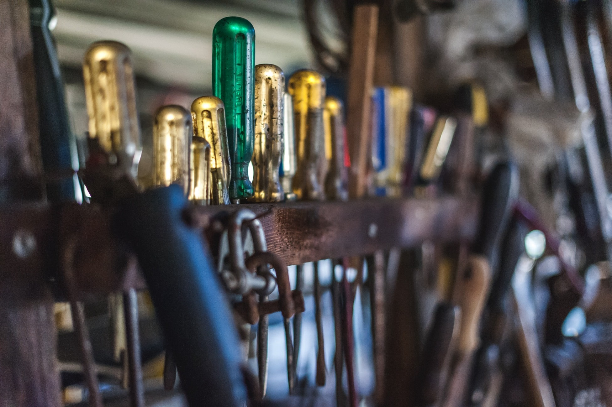

So I thought about sharing the tools I personally use personally or at work, so let’s start with the design tools:

* Adobe Illustrator for logos, icons, illustrations.
* Adobe XD or Invision Studio for designing user interfaces & wireframes.
* Adobe Photoshop for editing pictures & memes :D
* Adobe After effects for editing videos (I recommend Adobe Premiere Pro for editing videos & AE to add effects).
* Dribble for inspiration and I share my work there as well as on Behance

Let’s now get into the tools I use while coding:

I share my code & look for inspirations on:

* Github
* Codepen

If I’m simply coding an interface that I’ll might integrate in an app (web or native) I use plain html/css & vanilla js.

* Jekyll or Gatsby (I recommend Gatsby), I use Github to host the files and I deploy on Netlify. (jsx, sass, es6, markdown).

For Css I’m cool to use what ever tech available out there that makes my task done quickly & well, I personally have used Bootstrap 3 & 4, Bulma, Lostgrid, Materliaze, Tachyons & made my own little framework called Unnamed that has over 168 stars on Github, but I seriously prefer using cssgrid & I always enjoy styling my elements from scratch since the components are fully reusable with react.

If I’m making a web app, for the front end I use the `create-react-app` boilerplate as it’s the official one from the team that made React Js but I always have to add react-router, Redux, Recompose & many other modules I use the most.

I obviously use Git bash as my terminal when I’m on windows but iTerm2 when I’m on macOS & VScode as my code editor (material theme).

For the backend, I was using php/mysql but I didn’t personally like it and switched to node js and so I currently use Express Js/Mongoose and Mongodb as database to make Restful APIs which I deploy on Heroku.

Forgot to mention that I sometimes use Firebase when I’m too lazy to work on the backend.

For native apps, I use React native to build mobile apps (Ios & Android).

For scaling & growth, I focus more on building useful products that users really need in their lives then I simply share it on Product Hunt, Hacker news, Reddit and on social media.

I use Windows 10, MacOs High Sierra, my MSI GP62 laptop, my macbook pro 2017 touchbar work laptop, Nexus 6p with a Dbrand wood skin. Full setup can be found [here](https://docs.google.com/document/d/1falYEEHhJxq4HIXwOPoc4lk0AYsfHY4U6ZCcY4Srs8g/edit?usp=sharing).