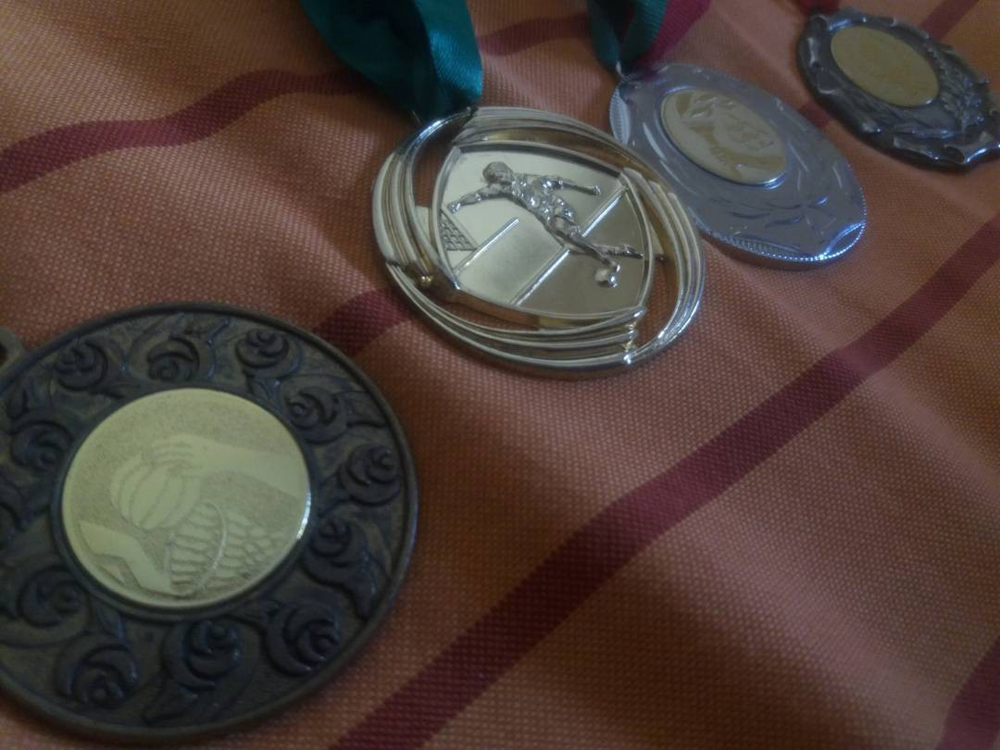
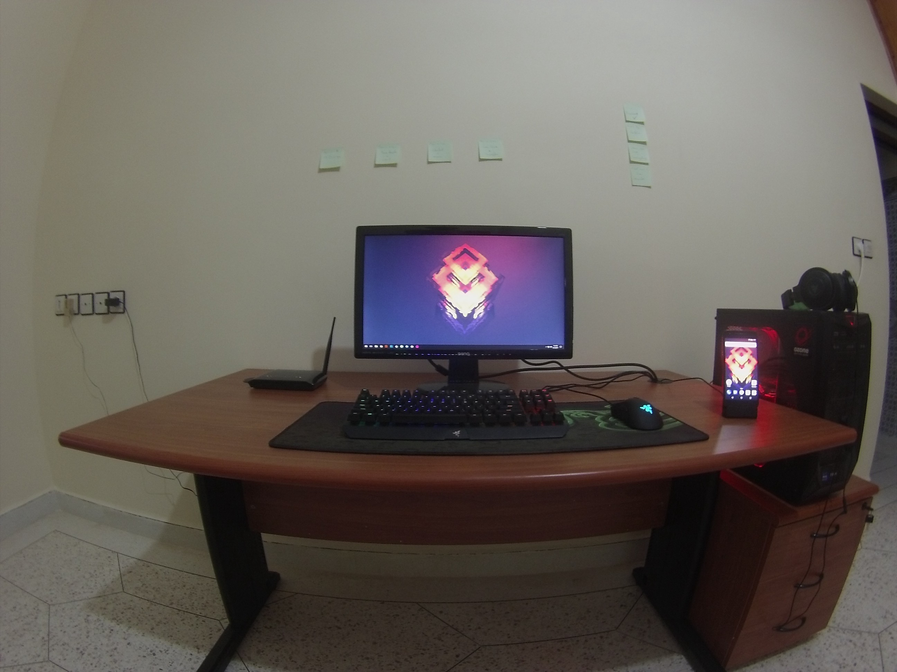

I’m Ismail Ghallou also known as Smakosh, a nickname which was given to me since I was 8 years old by my friend’s dad, many told me that I was a good student when I was at primary school & thanks to video games and to my dad for buying our first pc ever & also some anime I was watching at that time, then I decided to get into a public schools rather than a private school on the last year of primary school, at that time I got addicted to Basketball though I was a good player, specially in the streets(and1), here’s a picture of some medals I got from some tournaments I & my friends won on Football & Basketball.

During secondary school I started exploring more hobbies like drawing, graffiti, biking & skateboarding and I was still getting good marks though, at high school I got addicted to Parkour & Free running and it was really a good experience “to not be able to do a backflip then after a long period of training (even though there were no gyms) to actually do it ” it was something really amazing, I spent like 2 years practicing and have recorded some videos right [here](https://www.instagram.com/smakosh19).

    <iframe width="560" height="315" src="https://www.youtube.com/embed/bujbKsEKZ-4" frameborder="0" allow="encrypted-media" allowfullscreen></iframe>

During the last year of high school I got a gaming pc which my dad bought for me since I asked a lot for it, specially for gaming & it made me get addicted to gaming and so I graduated from high school with bad marks but yeah I got accepted in some sort of school which is equivalent to university & at that moment everything has changed, I started teaching myself at home, learning, practicing by doing side projects & working as a free lancer from november 2015 until now, I taught myself Graphic, UI/UX design, programming & web development (front end & back end), restudied maths — algebra linear, calculus, probabilities... — & now i’m still learning specially about machine & deep learning specially neural networks & willing to create some web & mobile apps based on Artificial intelligence to help people.

I actually [Got a job offer](/never-work-for-free) at a start up after completing one month paid internship which I declined since I graduated and willing to pursue my studies, I declined to too many other offers later on. I’m more interested in launching a start up!

you can view all my works on my website http://smakosh.com & more down bellow :

* Behance: https://www.behance.net/ismail16sm9991
* Github: https://github.com/smakosh
* Instagram: https://www.instagram.com/smakosh19
* Twitter: https://twitter.com/smakosh
* Facebook: https://www.facebook.com/Ismailghallou
* Youtube: https://www.youtube.com/user/smakoshthegamer
* Dribbble: https://dribbble.com/smakosh
* LinkedIn: https://www.linkedin.com/in/ismail-ghallou-630149122
* Codepen: https://codepen.io/Smakosh
* Creative market: https://creativemarket.com/Smakosh

And if you want to support me on Patreon, That would be helpful to my hosting :D https://www.patreon.com/smakosh